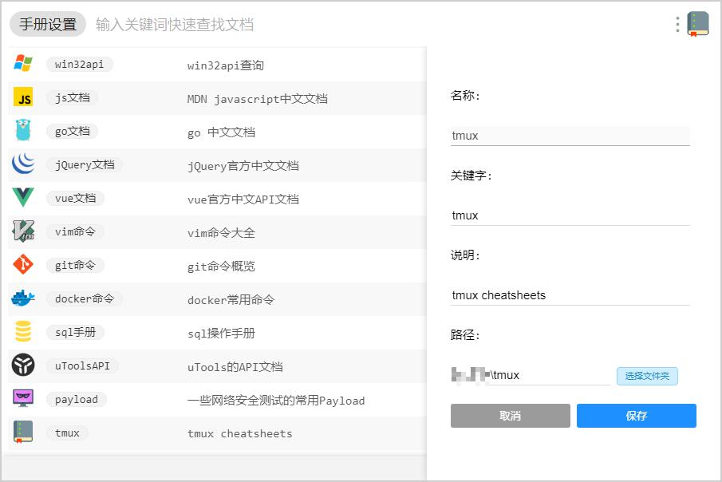
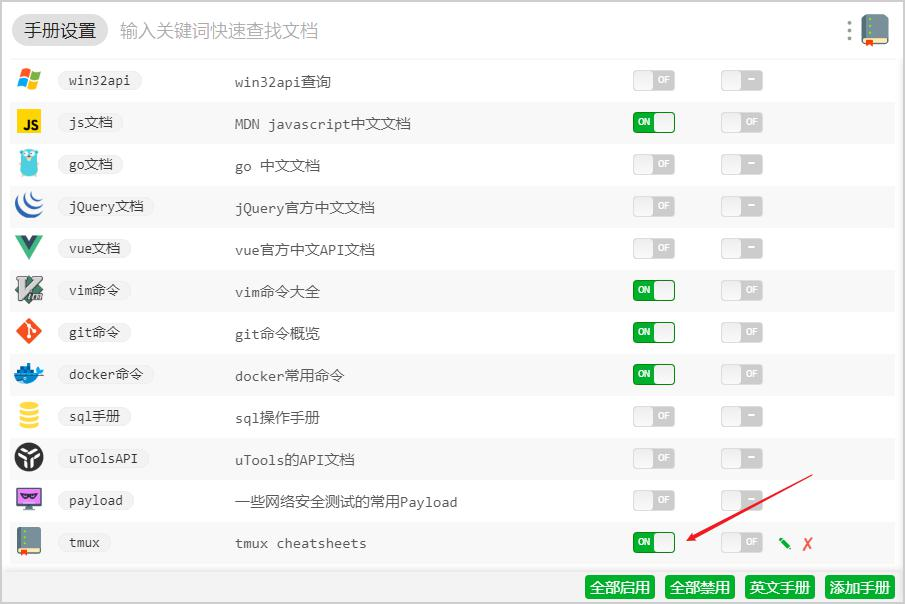
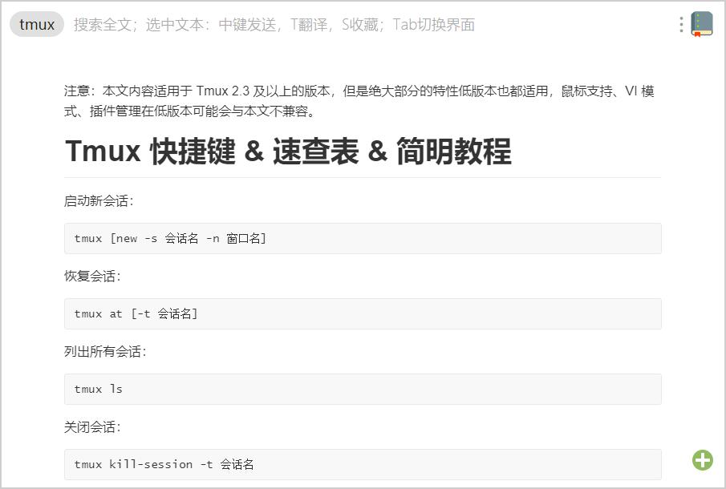

# TmuxCheatSheet

Tmux Cheat Sheet for uTools-Manuals

自制Tmux的一些快捷键列表，内容来源于 https://gist.github.com/ryerh/14b7c24dfd623ef8edc7 和 https://gist.github.com/MohamedAlaa/2961058 ， 感谢这两位的贡献。中英版都收录方便用英文单词的搜索。

## 使用方法

下载master，解压，然后在iuTools的插件，程序员手册中导入，路径请填写tmux文件夹所在的路径，名称请设置成tmux。导入后请记得打开“启用”，才能直接在uTools中搜索。

